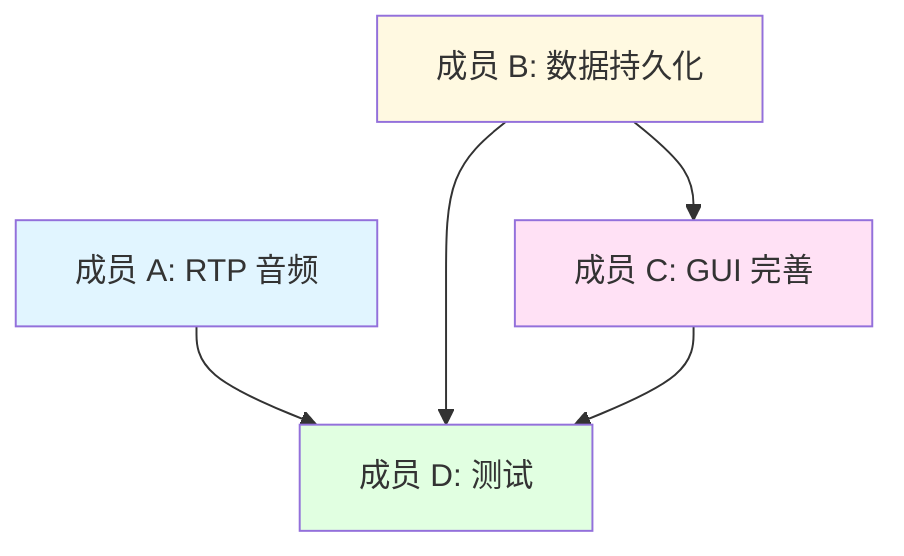

# SIP 通信系统 - 任务分工文档

> 项目当前进度：核心 SIP 信令 + JavaFX GUI 已完成  
> 待完成模块：RTP 媒体传输、数据持久化、高级功能、测试优化

---

## 📊 当前项目状态

### ✅ 已完成（约 60%）
- [x] SIP 协议实现（REGISTER/INVITE/MESSAGE/BYE/ACK）
- [x] 摘要认证（401/407 Challenge）
- [x] SIP 呼叫信令完整流程
- [x] JavaFX 图形界面（登录、主界面、来电、通话窗口）
- [x] 即时消息收发（类微信气泡）
- [x] 来电接听/拒接
- [x] Spring Boot 业务服务器（REST API）
- [x] JWT 认证
- [x] 命令行客户端

### 🔄 待完成（约 40%）
- [ ] RTP/RTCP 音频传输
- [ ] RTP 视频传输
- [ ] 数据库持久化
- [ ] GUI 与服务器 API 集成
- [ ] 群聊功能
- [ ] 文件传输
- [ ] NAT 穿透
- [ ] 测试和文档完善

---

## 👥 四人分工方案

### 🎯 分工原则
- **模块独立性**：各模块可并行开发
- **工作量均衡**：每人约 10-12 天工作量
- **技能匹配**：根据擅长领域分配
- **依赖最小化**：减少模块间等待时间

---

## 📋 详细任务分配

### 👤 **成员 A - RTP 音频通话实现** 🎵

**核心任务：实现端到端的音频通话功能**

#### 主要职责
1. **RTP 音频传输实现**（6 天）
   - [ ] 集成 RTP 库（Jitsi 或自己实现）
   - [ ] 实现 `AudioSession.java`
   - [ ] 音频采集（麦克风）- Java Sound API
   - [ ] 音频播放（扬声器）
   - [ ] PCMU/PCMA 编解码器
   - [ ] RTP 数据包发送/接收
   - [ ] RTCP 质量监控

2. **SDP 协商完善**（2 天）
   - [ ] 修改 `SipUserAgent.createInviteRequest()` 添加 SDP
   - [ ] 解析接收到的 SDP 响应
   - [ ] 协商音频编解码器和端口

3. **音频质量优化**（3 天）
   - [ ] 回声消除（可选）
   - [ ] 噪声抑制
   - [ ] 自动增益控制
   - [ ] 抖动缓冲区

4. **测试和调试**（2 天）
   - [ ] 局域网点对点通话测试
   - [ ] 音质测试和优化
   - [ ] 编写单元测试

#### 交付物
- `AudioSession.java` - 完整实现
- `RTPManager.java` - RTP 收发管理
- `AudioCodec.java` - 编解码器接口
- 音频通话测试报告
- API 文档

#### 技术栈
- Java Sound API
- Jitsi RTP 库（或自己实现）
- SDP 协议
- 音频编解码（PCMU/PCMA）

---

### 👤 **成员 B - 数据持久化与服务器集成** 💾

**核心任务：实现数据库存储和客户端-服务器通信**

#### 主要职责
1. **数据库设计与实现**（5 天）
   - [ ] 设计数据库表结构（用户、消息、通话记录）
   - [ ] 集成 Spring Data JPA
   - [ ] 实现 Entity 类
   - [ ] 实现 Repository 接口
   - [ ] 数据库迁移脚本（Flyway/Liquibase）

2. **服务器 API 完善**（3 天）
   - [ ] 完善用户管理 API（注册、登录、状态更新）
   - [ ] 消息存储 API（发送、接收、历史查询）
   - [ ] 通话记录 API（保存、查询）
   - [ ] 离线消息推送机制
   - [ ] WebSocket 实时通知

3. **客户端 API 集成**（3 天）
   - [ ] 实现 `ServerApiClient.java`
   - [ ] GUI 登录时调用服务器认证
   - [ ] 消息发送时调用服务器存储
   - [ ] 启动时拉取离线消息
   - [ ] 集成 WebSocket 接收推送

4. **测试和文档**（2 天）
   - [ ] API 接口测试（Postman/JUnit）
   - [ ] 数据库性能测试
   - [ ] 编写 API 文档（Swagger）

#### 交付物
- 数据库表设计文档
- Entity、Repository、Service 类
- RESTful API 完整实现
- `ServerApiClient.java` - HTTP 客户端
- Swagger API 文档
- 数据库迁移脚本

#### 技术栈
- Spring Data JPA
- MySQL / H2 Database
- Flyway / Liquibase
- RESTful API
- WebSocket
- OkHttp / HttpClient

---

### 👤 **成员 C - GUI 功能完善与用户体验** 🎨

**核心任务：完善 JavaFX 界面和用户交互**

#### 主要职责
1. **GUI 功能增强**（5 天）
   - [ ] 动态添加/编辑/删除联系人
   - [ ] 用户注销功能
   - [ ] 用户信息编辑（头像、昵称）
   - [ ] 联系人搜索和排序
   - [ ] 消息搜索功能
   - [ ] 聊天记录导出
   - [ ] 设置界面（通知、音频设备选择）

2. **聊天功能优化**（3 天）
   - [ ] 表情符号支持
   - [ ] 图片消息预览
   - [ ] 文件拖拽发送
   - [ ] 消息撤回功能
   - [ ] 消息已读/未读状态
   - [ ] 输入状态提示（"对方正在输入..."）

3. **通话界面优化**（2 天）
   - [ ] 音量指示器（VU Meter）
   - [ ] 通话质量显示（延迟、丢包率）
   - [ ] 静音功能实现
   - [ ] 免提/听筒切换
   - [ ] 通话记录显示

4. **UI/UX 优化**（2 天）
   - [ ] 主题切换（亮色/暗色模式）
   - [ ] 动画效果优化
   - [ ] 响应式布局
   - [ ] 键盘快捷键
   - [ ] 托盘图标和通知

5. **本地数据存储**（1 天）
   - [ ] 消息历史本地缓存（SQLite）
   - [ ] 用户配置持久化（Preferences）

#### 交付物
- 完善的 JavaFX 界面
- 新增 Controller 类
- 新增 FXML 界面文件
- 用户体验测试报告
- UI/UX 设计文档

#### 技术栈
- JavaFX 21
- FXML + CSS
- SQLite（本地存储）
- Java Preferences API
- ControlsFX（UI 组件库）

---

### 👤 **成员 D - 高级功能与测试优化** 🚀

**核心任务：实现高级功能和全面测试**

#### 主要职责
1. **文件传输功能**（4 天）
   - [ ] 文件选择和预览
   - [ ] 文件分块传输（通过 SIP MESSAGE 或 HTTP）
   - [ ] 传输进度显示
   - [ ] 断点续传支持
   - [ ] 文件接收和保存
   - [ ] 文件历史管理

2. **群聊功能**（4 天）
   - [ ] 群组创建和管理
   - [ ] 群成员管理（添加、删除、权限）
   - [ ] 群消息分发（通过服务器）
   - [ ] 群通话信令（会议模式）
   - [ ] 群聊界面实现

3. **NAT 穿透（可选）**（3 天）
   - [ ] 集成 STUN 客户端
   - [ ] 实现 TURN 中继（可选）
   - [ ] 外网测试环境搭建

4. **全面测试**（4 天）
   - [ ] 单元测试覆盖率提升（目标 80%）
   - [ ] 集成测试（客户端-服务器）
   - [ ] 压力测试（多用户并发）
   - [ ] 网络异常测试（断网、高延迟）
   - [ ] 兼容性测试（Windows/Linux/Mac）
   - [ ] 性能测试和优化

5. **文档完善**（2 天）
   - [ ] 完善 README.md
   - [ ] 编写开发者文档
   - [ ] 编写用户手册
   - [ ] 部署指南
   - [ ] 常见问题（FAQ）

#### 交付物
- 文件传输模块
- 群聊模块
- NAT 穿透实现（可选）
- 完整的测试套件
- 测试报告
- 完善的项目文档

#### 技术栈
- STUN/TURN 协议
- 多线程文件传输
- JUnit 5 + Mockito
- JMeter（压力测试）
- 文档生成工具

---

## 📅 开发时间线（建议 2 周）

### Week 1（第 1-7 天）

| 成员 | 第 1-2 天 | 第 3-4 天 | 第 5-6 天 | 第 7 天 |
|-----|----------|----------|----------|--------|
| **A** | RTP 库集成 | 音频采集/播放 | RTP 收发 | 联调 |
| **B** | 数据库设计 | Entity/Repository | API 实现 | 联调 |
| **C** | 联系人管理 | 消息功能 | 通话界面 | 联调 |
| **D** | 文件传输设计 | 文件传输实现 | 群聊设计 | 联调 |

### Week 2（第 8-14 天）

| 成员 | 第 8-9 天 | 第 10-11 天 | 第 12-13 天 | 第 14 天 |
|-----|----------|------------|------------|---------|
| **A** | RTCP 质量监控 | 音频优化 | 测试调试 | 文档 |
| **B** | WebSocket | 客户端集成 | API 测试 | 文档 |
| **C** | UI/UX 优化 | 本地存储 | 用户测试 | 文档 |
| **D** | 群聊实现 | 全面测试 | 性能优化 | 文档 |

---

## 🔗 模块依赖关系

**关键依赖点：**
1. 成员 C 的"离线消息显示"依赖成员 B 的"服务器 API"
2. 成员 C 的"通话质量显示"依赖成员 A 的"RTCP 监控"
3. 成员 D 的测试依赖所有模块完成

**并行度高的任务：**
- 成员 A 和 B 可完全并行
- 成员 C 的大部分任务可独立完成

---

## 📞 协作方式

### 日常沟通
- **每日站会**（15 分钟）
  - 每人汇报：昨天完成 / 今天计划 / 遇到的问题
  - 时间：每天上午 9:30

- **代码评审**
  - 每个 Pull Request 至少 1 人 Review
  - 关键模块需要 2 人 Review

### 技术讨论
- **周中技术会议**（第 4 天，1 小时）
  - 讨论遇到的技术难点
  - 统一接口设计
  - 调整任务优先级

- **周末集成测试**（第 7 天、第 14 天）
  - 各模块联调
  - 集成测试
  - 问题汇总

### 文档规范
- **代码注释**：关键方法必须有 JavaDoc
- **提交信息**：格式 `[模块] 简短描述`，例如 `[RTP] 实现音频采集功能`
- **API 文档**：每个公共接口必须有文档

---

## 🛠️ 开发环境统一

### 必需工具
- JDK 17
- Maven 3.x
- Git
- IDE：IntelliJ IDEA（推荐）或 Eclipse

### 推荐安装
- Postman（API 测试）
- Scene Builder（JavaFX 可视化设计）
- MySQL Workbench（数据库管理）
- Wireshark（网络抓包）

### 代码规范
- 遵循 Google Java Style Guide
- 使用 IDE 自动格式化
- 变量命名采用驼峰命名法
- 常量使用全大写下划线

---

## 📊 验收标准

### 成员 A - RTP 音频
- [ ] 两个客户端可以进行清晰的语音通话
- [ ] 延迟 < 300ms
- [ ] 丢包率 < 5% 时音质可接受
- [ ] 单元测试覆盖率 > 70%

### 成员 B - 数据持久化
- [ ] 数据库表设计合理，满足 3NF
- [ ] 所有 API 接口可用，响应时间 < 500ms
- [ ] 客户端可正常拉取离线消息
- [ ] API 文档完整（Swagger）

### 成员 C - GUI 完善
- [ ] 所有新功能界面美观、交互流畅
- [ ] 无明显 UI Bug
- [ ] 支持键盘快捷键
- [ ] 用户体验测试通过（至少 3 人测试）

### 成员 D - 高级功能与测试
- [ ] 文件传输成功率 > 95%
- [ ] 群聊功能基本可用
- [ ] 单元测试覆盖率 > 80%
- [ ] 压力测试通过（100 并发用户）
- [ ] 文档齐全

---

## 🎯 里程碑

### Milestone 1（第 7 天）- 核心功能完成
- [ ] 音频通话基本可用（成员 A）
- [ ] 数据库和基础 API 完成（成员 B）
- [ ] GUI 主要功能完成（成员 C）
- [ ] 文件传输原型完成（成员 D）

### Milestone 2（第 14 天）- 项目交付
- [ ] 所有模块集成完成
- [ ] 测试通过
- [ ] 文档齐全
- [ ] 演示 PPT 准备好

---

## 📝 额外建议

### 风险控制
1. **技术难点提前攻克**
   - 成员 A 的 RTP 实现建议第 1-2 天快速验证可行性
   - 成员 D 的 NAT 穿透如果困难可降级为局域网测试

2. **任务缓冲时间**
   - 每个任务预留 1-2 天缓冲
   - 复杂任务拆分成小步骤

3. **备用方案**
   - RTP 自己实现困难 → 改用 Jitsi 库
   - 群聊太复杂 → 降级为简单的消息群发

### 加分项（时间充裕可选）
- [ ] Docker 容器化部署
- [ ] CI/CD 流水线（GitHub Actions）
- [ ] 视频通话（H.264 编解码）
- [ ] 端到端加密
- [ ] 多语言支持（i18n）
- [ ] 移动端客户端（Android）

---

## 📚 参考资料

### RTP/RTCP
- [RFC 3550 - RTP](https://www.rfc-editor.org/rfc/rfc3550)
- [Jitsi 官方文档](https://jitsi.github.io/handbook/)

### SIP/SDP
- [RFC 3261 - SIP](https://www.rfc-editor.org/rfc/rfc3261)
- [RFC 4566 - SDP](https://www.rfc-editor.org/rfc/rfc4566)

### JavaFX
- [OpenJFX 文档](https://openjfx.io/)
- [Scene Builder](https://gluonhq.com/products/scene-builder/)

### Spring Boot
- [Spring Boot 官方文档](https://spring.io/projects/spring-boot)
- [Spring Data JPA](https://spring.io/projects/spring-data-jpa)

---

## 🎓 总结

这份分工方案确保：
- ✅ **模块独立**：各成员可并行开发，减少等待
- ✅ **工作量均衡**：每人 10-13 天工作量
- ✅ **技能匹配**：根据技术栈分配任务
- ✅ **可测试性**：每个模块都有明确的验收标准
- ✅ **风险可控**：有备用方案和缓冲时间

**预祝项目顺利完成！** 🎉
